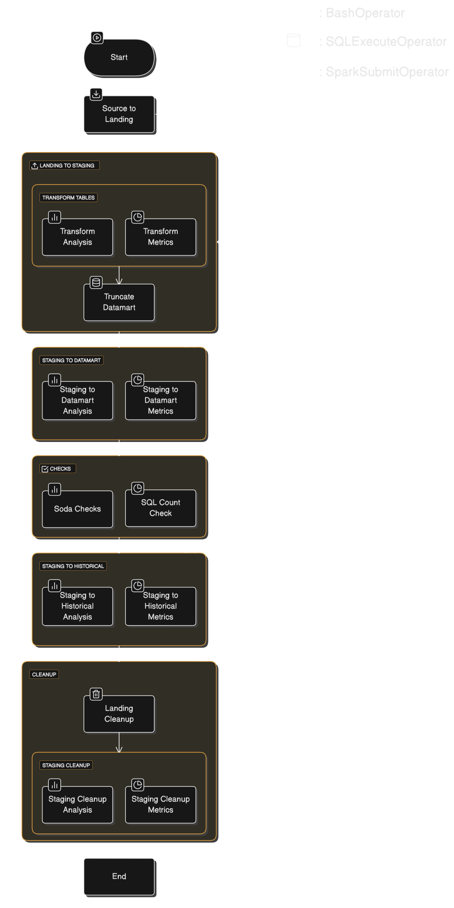
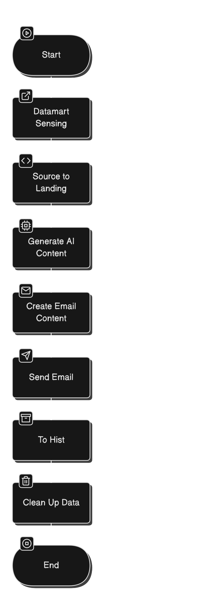

# Airflow DAGs

This directory contains the Airflow DAGs (Directed Acyclic Graphs) that orchestrate the ETL pipelines and workflows.

## DAGs

### `source2main_hourly_el.py`


This DAG fetches recent played songs from the Flask API and loads them into the main database on an hourly basis. It includes the following key components:

- Extracting data from the Flask API
- Loading data into landing zone
- Staging and transforming data
- Loading data into the main database (enriching dimensions and loading facts)
- Data quality checks using Soda SQL
- Archiving processed data to historical storage
- Cleanup of temporary files

The DAG also handles full data loads when running for the first time.

### `spotify_analysis_monthly_etl.py`



This DAG performs a comprehensive monthly ETL pipeline for analyzing Spotify listening data. It includes the following stages:

- Extracting data from source tables and loading into landing zone as parquet files
- Transforming raw data into various analysis tables (album completion, play counts, listening patterns, etc.)
- Loading transformed data into the analysis datamart
- Archiving data to historical storage
- Data quality checks using SQL and Soda SQL
- Cleanup of temporary files

The DAG uses Apache Spark for large-scale data processing.

### `wrapped_email_blast_monthly.py`



This DAG generates and sends a monthly "Spotify Wrapped" style email blast. It includes the following steps:

- Extracting listening data from the analysis datamart
- Generating personalized content and insights using AI (via the Generative AI API)
- Creating an HTML email template with the personalized content
- Sending the email blast
- Archiving data and cleaning up temporary files

The DAG is scheduled to run monthly and depends on the successful completion of the `spotify_analysis_etl` DAG.

## Python Scripts

The DAGs utilize various Python scripts located in the `python_scripts` directory for data processing, AI content generation, and utility functions.

## Sensors

Custom Airflow sensors are defined in the `sensors` directory:

- `latest_status_sensor.py`: Sensor to check the status of an external DAG
- `sql_data_sensor.py`: Sensor to check for the presence of data in the main database tables for the last 31 days

These sensors are used in the DAGs to create dependencies and ensure data availability.

## Usage

The DAGs are scheduled to run automatically based on their defined schedules (`@hourly`, `@monthly`).

To manually trigger a DAG run, use the Airflow UI or the Airflow CLI:

```bash
airflow dags trigger <dag_id>
```

Monitor the DAG runs in the Airflow UI to check for any failures or issues. The logs and data quality check reports can provide additional details on the pipeline execution.
