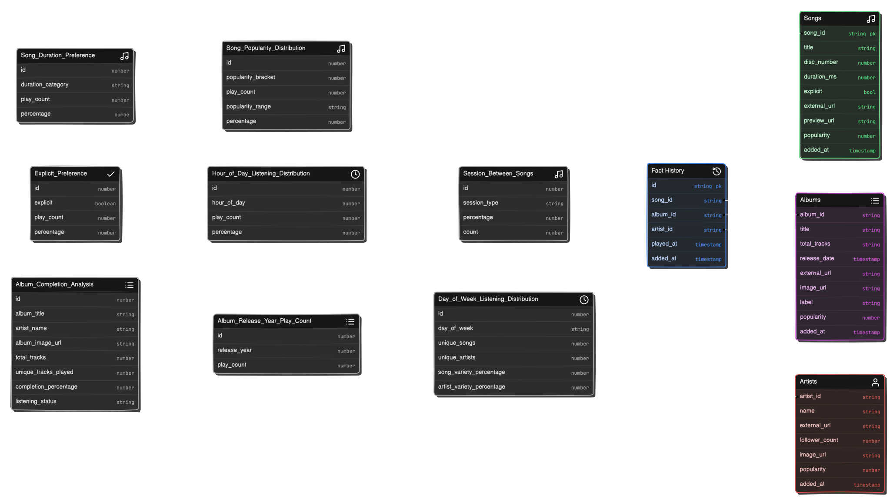

# SQL Scripts

This directory contains SQL scripts used in the Spotify data pipeline.



## Scripts

### `insert_main_album.sql`

This script inserts sample data into the `dim_album` table in the main database. It includes a variety of album records with different attributes such as album ID, title, total tracks, release date, external URL, image URL, label, and popularity.

The script is used to populate the `dim_album` table with initial data for testing and development purposes.

### Usage

To execute the SQL script and insert the sample data into the `dim_album` table, you can use a PostgreSQL client or run the script through a database management tool.

For example, using the `psql` command-line tool:

```bash
psql -U <username> -d <database_name> -f insert_main_album.sql
```

Replace `<username>` with your PostgreSQL username and `<database_name>` with the name of the database where the `dim_album` table is located.

### Other SQL Scripts

The `sql` directory may contain other SQL scripts used in the data pipeline, such as:

- DDL scripts for creating tables and schemas
- DML scripts for inserting, updating, or deleting data
- Utility scripts for database maintenance or data transformations

Please refer to the individual script files for more details on their purpose and usage.

## Database Connection

The SQL scripts assume a connection to the appropriate PostgreSQL database. Make sure to update the connection details in the scripts or configure the database connection separately before executing the scripts.

## Dependencies

The SQL scripts are written for PostgreSQL and may use PostgreSQL-specific syntax and features. Ensure that you have a compatible version of PostgreSQL installed and properly configured.

## Maintenance

If you make changes to the database schema or need to modify the sample data, update the corresponding SQL scripts in this directory. Keep the scripts organized and well-documented to facilitate maintenance and understanding of the database structure.

## Security

Be cautious when executing SQL scripts, especially those that modify data or perform database operations. Review the scripts carefully before running them to ensure they align with your intended actions and do not introduce any security vulnerabilities or data inconsistencies.

It is recommended to run the SQL scripts in a controlled environment and have proper backup and recovery mechanisms in place to safeguard your data.
